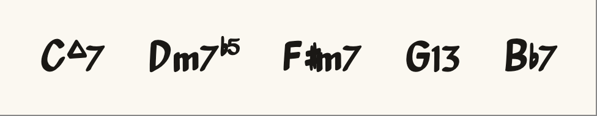
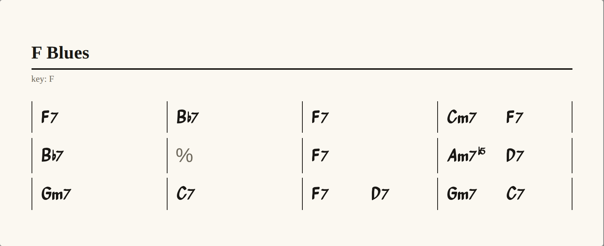
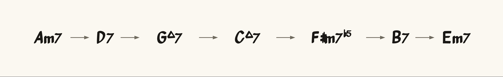

# chordlang

**Live demo:** [borkxs.github.io/chordlang](https://borkxs.github.io/chordlang)

A portable, text-authored, properly-engraved **chord-changes** format for
lead sheets and harmonic graphs. Chart syntax follows familiar fake-book
conventions (bars, beat subdivisions, section markers); the differentiator
is rendering — chord symbols are engraved by an OpenType font, not styled
with CSS superscripts.

## Quick start

```
make setup     # install (pnpm) + Playwright chromium
make dev       # live playground — type text, watch it engrave
make test      # vitest across packages
make previews  # regenerate docs/assets/ preview images
make help      # every target, self-documented
```

Preview images are committed PNGs, not live GitHub renders — see
[`docs/readme-previews.md`](docs/readme-previews.md) for when to re-run and commit.

## ChordFont

An OpenType font that engraves single-line jazz chord symbols from plain ASCII
via GSUB ligatures — the shaping engine does the work, no JavaScript at render
time. Outlines derived from [Petaluma](https://github.com/steinbergmedia/petaluma)
(OFL). Build and spec: [`packages/font/`](packages/font/).

Source (`examples/font/readme-symbols.txt`):

```
Cmaj7 Dm7b5 F#m7 G13 Bb7
```



## Charts

Lead-sheet chord changes in `.cfmd` — a Peggy grammar for structure, ChordFont
for symbols. Commas subdivide a bar into equal beat-slots; `%` repeats the
previous bar; `[A]` marks a form section. Grammar IS the spec:
[`packages/parse/src/chart.peggy`](packages/parse/src/chart.peggy).

Source (`examples/charts/blues-in-f.cfmd`):

```
{title: F Blues}
{key: F}
| F7 | Bb7 | F7 | Cm7,F7 |
| Bb7 | % | F7 | Am7b5,D7 |
| Gm7 | C7 | F7,D7 | Gm7,C7 |
```



More charts in [`examples/charts/`](examples/charts/) · live edit with `make dev`.

## Graphs

Harmonic progressions as standard [Graphviz DOT](https://graphviz.org/doc/info/lang.html)
in `.cfgv`. Node labels use `fontname="ChordFont"`; chordlang post-styles the SVG.

Source (`examples/graphs/ii-v-i-chain.cfgv`):

```
digraph {
  rankdir=LR;
  graph [bgcolor="transparent" pad=0.4];
  node [shape=plaintext fontname="ChordFont" fontsize=36];
  edge [color="#6f6a5e" penwidth=1.4 arrowsize=0.7];

  Am7 -> D7 -> Gmaj7 -> Cmaj7 -> "F#m7b5" -> B7 -> Em7;
}
```



More graphs in [`examples/graphs/`](examples/graphs/) · HTML gallery with `make graphs`.

## Prior art

“Chord chart” here means **lead-sheet chord changes** — the bar-grid notation
musicians use in Real Book charts, iReal Pro, ChordPro, and similar tools.
chordlang borrows **structure conventions** from that world (design references
only; no code imported — see [ADR-001](DECISIONS.md#adr-001-license-hygiene--conventions-in-code-out)):

| Convention | Familiar from |
|------------|---------------|
| `\| bar \| bar \|` grid | lead sheets / fake books |
| `Cm7,F7` — comma subdivides a bar into equal beats | [QuickChords](https://www.twelvetone.tv/docs/arts-and-education/quickchords/quickchords-markdown-language), [iReal Pro](https://irealpro.com/) |
| `{title: …}` metadata directives | [ChordPro](https://www.chordpro.org/) |
| `[A]` form-section labels | iReal Pro |
| `%` repeats the previous bar | iReal Pro |

What is **not** borrowed: symbol engraving. Most web renderers fake chord
typography with HTML/CSS; chordlang types ASCII and lets [ChordFont](#chordfont)
shape it via OpenType ligatures.

## Dependencies

| Component | Role | License |
|-----------|------|---------|
| [tonal](https://www.npmjs.com/package/tonal) | chord-symbol parsing / normalization | MIT |
| [Petaluma](https://github.com/steinbergmedia/petaluma) | glyph outlines for ChordFont | OFL |
| [Peggy](https://peggyjs.org/) | chart grammar → parser | MIT |
| [Graphviz](https://graphviz.org/) | `.cfgv` harmonic graph layout | EPL |
| fonttools, uharfbuzz, cu2qu | ChordFont build + shaping tests | MIT / Apache / MIT |

Dev-only: Playwright (README preview screenshots), Vite (playground).

## Related

- [DECISIONS.md](DECISIONS.md) — architecture notes (grammar spec, tonal wrapper, rendering split)
- [CODEBASE.md](CODEBASE.md) — package map and data flow
- [docs/readme-previews.md](docs/readme-previews.md) — regenerating README preview PNGs
- [examples/README.md](examples/README.md) — editing `.cfmd` / `.cfgv` sources

Topics: `chord-charts`, `lead-sheet`, `jazz`, `chord-symbols`, `open-type`, `graphviz`.

## Layout

```
examples/           .cfmd / .cfgv / .txt sources + manifest
docs/assets/        committed preview PNGs (make previews)
packages/chord      normalize(symbol) → canonical struct
packages/parse      Peggy chart grammar → AST (grammar IS the spec)
packages/render     AST + chart.css → engraved HTML
packages/font       ChordFont OpenType build (Python)
packages/cli        chordlang <ast|canonical|html> file.cfmd
apps/playground     live preview (src-aliased packages)
tools/corpus        stub: McGill/Weimar frequency mining (future)
```
