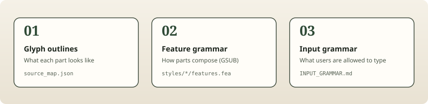
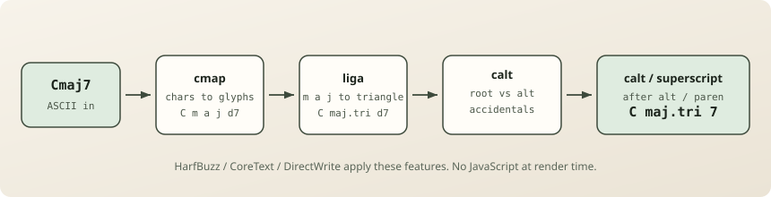
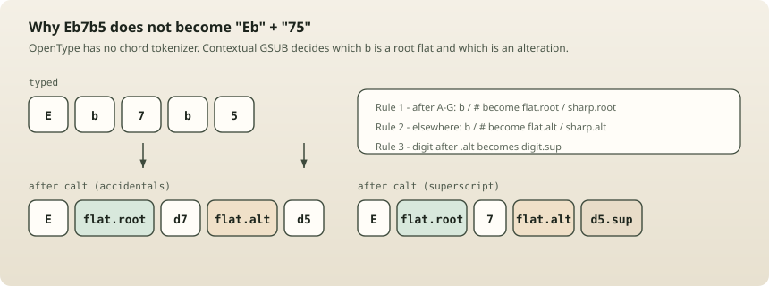
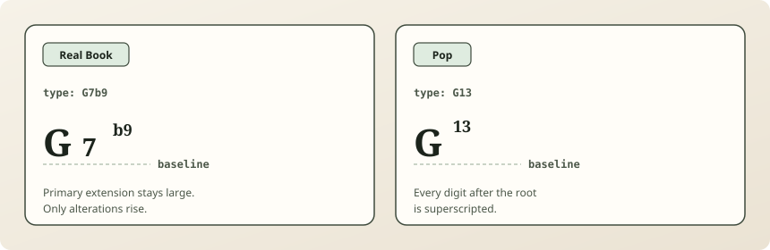
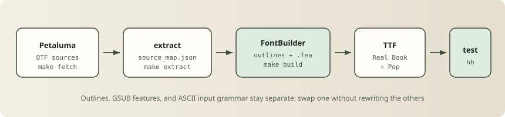
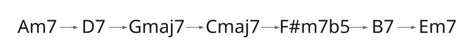

# How ChordFont works

*Type `Cmaj7` in LibreOffice. Watch it become C△7 mid-keystroke. The font is the renderer.*

ChordFont is an OpenType font that engraves jazz and pop chord symbols from plain ASCII. There is no JavaScript at render time — ligatures and contextual substitutions in the font file do the work inside HarfBuzz, CoreText, or DirectWrite.

This post walks through the mechanism: why put engraving in a font, how GSUB stages compose a symbol, how Real Book and Pop styles differ, and where OpenType hits a wall.

**Live demo:** [borkxs.github.io/chordlang](https://borkxs.github.io/chordlang) · **Source:** [`packages/font/`](../../packages/font/)


---

## The problem

Lead-sheet harmony has a visual language: △ for major seventh, ø for half-diminished, ♭⁹ tucked above the baseline after a large 7. Web charts usually fake that with CSS spans, Unicode lookalikes, or a custom SVG renderer. Desktop apps get left out entirely.

The interesting constraint: chord symbols are still *text*. Musicians type them. Editors search them. PDFs should keep a text layer. So the engraving should live where text already lives — in the shaping engine.

## The insight: the font is the API

ChordFont’s contract is simple:

```
ASCII chord string  →  engraved glyph stream
```

Any app that enables OpenType `liga` and `calt` gets engraved symbols for free: Graphviz, Typst, XeLaTeX, LilyPond, LibreOffice, Inkscape, ffmpeg `drawtext`, and the browser playground. See [`docs/font-integrations.md`](../font-integrations.md).

```css
font-feature-settings: "liga" 1, "calt" 1;
```

GSUB is the engraving spec. A separate normalizer (in `@chordlang/chord`) is the harmony spec — messy real-world spellings fold to canonical ASCII before the font sees them.

---

## Three concerns, kept apart



| Layer | Role | Lives in |
|-------|------|----------|
| **Outlines** | How each part looks when drawn | `glyphs/source_map.json` + Petaluma extract |
| **Features** | How parts compose | `styles/*/features.fea` |
| **Input grammar** | What ASCII the font expects | `grammar/INPUT_GRAMMAR.md` |

Outlines can be redrawn without touching GSUB. Feature rules can change without re-tuning every path. The input dialect can evolve behind a normalizer. That separation is deliberate (ADR-003).

---

## The shaping pipeline

When you type `Cmaj7`, the shaping engine walks a short pipeline:



1. **cmap** — characters map to glyph names (`C`, `m`, `a`, `j`, `d7`).
2. **liga** — `m a j` becomes `maj.tri` (the △). `dim` / `o` become `dim.ring`.
3. **calt (accidentals)** — `#` / `b` after A–G become root accidentals; elsewhere they become alteration accidentals.
4. **calt (superscripts)** — digits after alteration accidentals (or inside typed `(`) become `.sup` glyphs; multi-digit chains like `#11` keep rising.

The Real Book feature file is short enough to read in one sitting:

```fea
feature liga {
    sub m a j by maj.tri;
    sub d.lc i m by dim.ring;
} liga;

feature calt {
    sub [A B C D E F G] numbersign' by sharp.root;
    sub [A B C D E F G] b' by flat.root;
    sub b' by flat.alt;
    sub numbersign' by sharp.alt;
} calt;

feature calt {
    sub flat.alt @digit' by @digitsup;
    sub sharp.alt @digit' by @digitsup;
    sub parenleft @digit' by @digitsup;
    sub @digitsup @digit' by @digitsup;
} calt;
```

---

## The hard part: accidental binding without a tokenizer

OpenType does not parse chords. It only looks at neighboring glyphs. That is enough for the classic trap: `Eb7b5` must become E♭7♭⁵, not “Eb” followed by “75”.



The rule is contextual:

- After a root letter A–G → `flat.root` / `sharp.root`
- Anywhere else → `flat.alt` / `sharp.alt`
- Digit after an alt accidental → superscript

So `F#m7b5` shapes as:

| Stage | Glyph stream |
|-------|----------------|
| cmap | `F numbersign m d7 b d5` |
| accidentals | `F sharp.root m d7 flat.alt d5` |
| superscripts | `F sharp.root m d7 flat.alt d5.sup` |

Shape tests lock this in with uharfbuzz — glyph-name streams, not golden images:

```python
"Eb7b5": "E flat.root d7 flat.alt d5.sup",
"Dm7b5": "D m d7 flat.alt d5.sup",
"G7b9":  "G d7 flat.alt d9.sup",
```

Parentheses are never auto-inserted. Type `G7b9` for inline engraving; type `G7(b9)` when you want linear parens (ADR-008).

---

## Real Book vs Pop: two hierarchies

Jazz lead sheets and pop charts disagree about vertical rhythm. ChordFont ships two TTFs rather than one compromise face.



| Input | Real Book | Pop |
|-------|-----------|-----|
| Major 7 | `Cmaj7` → C△7 | `CM7` → CM⁷ |
| Dominant | `C7` → C7 (baseline) | `C7` → C⁷ |
| Extension | `G13` → G13 | `G13` → G¹³ |
| Alteration | `G7b9` → G7♭⁹ | `G7b9` → G⁷♭⁹ |

Real Book keeps primary extensions on the baseline and only raises alterations. Pop superscripts every digit after the root. Same accidental-binding machinery; different second `calt` block.

---

## How the font is built



```bash
make fetch    # pinned Petaluma OTFs
make extract  # outlines via source_map.json
make build    # FontBuilder + features.fea → TTF
make test     # uharfbuzz shape assertions
```

Handwritten outlines come from [Petaluma](https://github.com/steinbergmedia/petaluma) (SIL OFL): letters from PetalumaScript, chord ornaments (`csymMajorSeventh`, flats, dim ring, half-dim, bar repeat) from Petaluma’s SMuFL set. Extraction normalizes to UPM 1000, converts cubics to quadratics, and applies per-glyph `scale` / `dx` / `dy` from the source map. Superscripts are the same digit outlines at 0.6 scale, raised 360 units.

The OpenType feature code is the durable asset. Outlines are swappable — important while the prototype still derives paths from Petaluma (ADR-005).

---

## What the font cannot do

OpenType GSUB operates on a **1D glyph stream**. That covers nearly every common lead-sheet symbol, including chained alterations:

```
G7#5b9        →  G7♯⁵♭⁹
B7b5b9b11b13  →  inline stack of superscripts
```

It does **not** cover true 2D vertical stacks of parenthesized tensions:

```
G7(♯11)
  (♭13)     ← WALL tier — needs SVG / JS layout
```

That limit is documented, not papered over. For those rare symbols, fall back to a 2D renderer; keep the font for everything that fits on one line.

Difficulty tiers we use internally:

| Tier | Mechanism | Status |
|------|-----------|--------|
| Easy | Single ligatures (`maj`→△, `F#`→F♯) | Done |
| Hard | Contextual superscripts, multi-digit alts | Proven in HarfBuzz |
| Wall | 2D parenthesized tension stacks | Out of font scope |

---

## Beyond the browser

Because engraving lives in the OS text stack, installing the TTF makes chord symbols appear in any native text box. Verified consumers include:

- **Graphviz** — `fontname="ChordFont"` on DOT / `.cfgv` labels
- **Typst** — `text(font: "ChordFont-Real Book")`
- **XeLaTeX / LuaLaTeX** — `fontspec` with `Ligatures=Common, Contextuals=Alternate`
- **LilyPond** — `\markup` chord symbols above real staves
- **LibreOffice** — live mid-keystroke ligatures
- **ffmpeg `drawtext`** — engraved overlays on practice videos

Example Graphviz output using ChordFont in labels:



---

## Design rules worth stealing

1. **Put the hard problem in the right layer.** Engraving is typography; keep it in OpenType. Layout (bars, systems, graphs) stays in your app.
2. **Tests as spec.** `shape_test.py` asserts glyph streams. Visual lookbooks catch aesthetics; shape tests catch regressions.
3. **Separate data from logic.** Outlines ≠ features ≠ input dialect.
4. **Be honest about walls.** 1D GSUB will not do 2D stacks — document the escape hatch early.
5. **Ship style as a font, not a theme flag.** Real Book vs Pop are different TTFs because the hierarchy difference is structural.

---

## Try it

```bash
npm install @chordlang/font
```

```css
@font-face {
  font-family: "ChordFont-RealBook";
  src: url("node_modules/@chordlang/font/fonts/ChordFont-Real Book.ttf")
    format("truetype");
}
.chord {
  font-family: "ChordFont-RealBook", serif;
  font-feature-settings: "liga" 1, "calt" 1;
}
```

Or open the [playground](https://borkxs.github.io/chordlang), type `Cmaj7 Dm7b5 F#m7 G13 Bb7`, and toggle features off to see the raw glyph stream against the engraved result.

---

*Part of [chordlang](https://github.com/borkxs/chordlang) — ChordFont, `.cfmd` charts, and `.cfgv` harmony graphs.*
