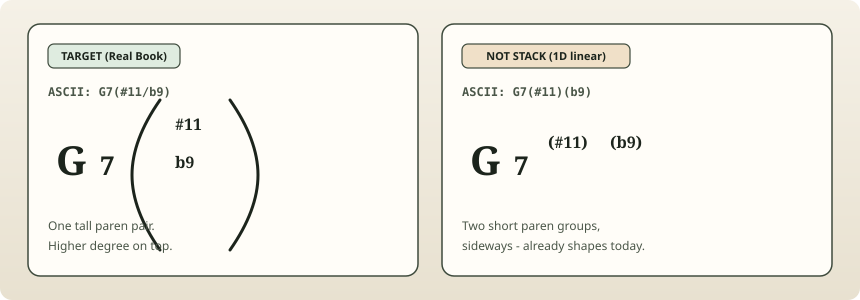
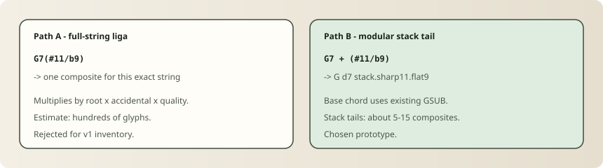

# Design note: Precomposed stack ligatures vs WALL+SVG

**Status:** Recommendation — **hybrid (Path B closed set), before general SVG**  
**Prototype:** Real Book `G7(#11/b9)` → `G d7 stack.sharp11.flat9` (shape tests green)  
**ADR:** [ADR-012](../../packages/font/DECISIONS.md) (amends ADR-006)

---

## Question

Is the corpus-backed space of stacked parenthesized tension forms small enough that ChordFont should ship **precomposed stack ligatures** instead of (or before) an SVG fallback?

## Verdict

**Yes — for a closed 2-high tension-stack allowlist, via Path B (modular tails).**  
Stay WALL/SVG for verbal add/omit stacks, depth > 2, and anything outside the allowlist.

| Option | Decision |
|--------|----------|
| Precompose closed set (Path B) | **Go** — ship allowlist of ~5–15 stack-tail composites |
| Full-string liga (Path A) | **No-go** — root×quality explosion |
| Stay WALL + SVG only | **No-go as first move** — SVG is a new product; corpus of true stacks is tiny enough to precompose |
| Hybrid | **Recommended** — Path B for allowlist; SVG later for open-ended towers |

---

## 1. Target visual



| | Real Book **stack** (target) | Linear multi-paren (not stack) |
|--|------------------------------|--------------------------------|
| Visual | One **tall** paren; two alteration rows, higher degree on top | Two short paren groups, sideways |
| ASCII | `G7(#11/b9)` | `G7(#11)(b9)` |
| Today | WALL (until this note) | Already shapes in 1D |
| Gold ref | New Real Book chord guide | ADR docs / LilyJAZZ linear style |

Canonical ordering of atoms helps the **input dialect**. It does **not** create 2D layout. Stacking is either (a) a pre-drawn composite triggered by liga, or (b) a 2D renderer. GSUB cannot do general 2D.

The ADR-006 example `G7(#11)(b13)` was a **mis-encoding** of the Real Book visual. Sequential `()()` is linear; the guide uses **one tall paren** with a vertical pair (transcribed here as slash-inside-paren).

---

## 2. Corpus inventory

Sources mined: `tools/lookbook/entries.json` (142), OpenBook harvest notes, `examples/charts/`, New Real Book guide PNG, shape tests / INPUT_GRAMMAR WALL examples.

### Distinct stacked / multi-paren forms found

| Form | Kind | Where | Count |
|------|------|-------|------:|
| `C7(b9/b5)`, `C7(#9/#5)`, `C7(b9/#5)`, `C7(#11/b9)`, `C7(#11/#9)` | **True 2-high stack** (single tall paren) | NRB guide only | **5** |
| `Bb(add b13/add 9)`, `A+(add #9/add b9)` | Verbal add stacks | NRB guide | 2 |
| `G7(#11)(b13)`, `G7(♯11)(♭13)` | Multi-paren ASCII (linear if shaped) | Docs / WALL examples only | 0 in lookbook/charts |
| `C7(♭9♯11)`, `B7(b5b9b11b13)` | Multi-alt in one paren / doc wrap | Docs / GAP_REPORT | 0 printed stacks |
| `G7(b9)`, `C7(#11)`, `Bm7(b5)`, … | Single-paren linear | Lookbook ADR-008 cards | in-font already |
| `G7#5b9`, `A13b9`, `B7b5b9b11b13`, … | Bare multi-alt **inline** | Lookbook + OpenBook | in-font already (1D) |

**Lookbook true-stack cards: 0 / 142.**  
**Chart / OpenBook true stacks: 0.**  
**Printed gold-standard tension stacks: 5** (NRB guide).

Deduplicated by normalized factor set `{top, bottom}` + paren structure (single tall pair):

| top | bottom | Canonical tail | NRB guide |
|-----|--------|----------------|:---------:|
| #11 | b9 | `(#11/b9)` | yes |
| #11 | #9 | `(#11/#9)` | yes |
| b9 | b5 | `(b9/b5)` | yes |
| #9 | #5 | `(#9/#5)` | yes |
| b9 | #5 | `(b9/#5)` | yes |
| #11 | b13 | `(#11/b13)` | no (common tower; extend allowlist) |

Full machine-readable list: [`packages/font/stacks/allowlist.json`](../../packages/font/stacks/allowlist.json).

---

## 3. Closed grammar (stacks only)

```
stack_chord  := root [accidental] quality_or_ext stack_tail
stack_tail   := '(' atom '/' atom ')'          # depth = 2 exactly
atom         := 'b5' | '#5' | 'b9' | '#9' | '#11' | 'b13'
```

Rules:

1. **Depth ≤ 2** for in-font precompose.
2. **One paren pair** — slash means “stacked over”, not a bass slash (bass slash stays outside: `G7(#11/b9)/F` TBD later).
3. **Fixed top→bottom order** — higher degree on top; when equal, sharp above flat; otherwise allowlist order.
4. **Allowlist, not free product** of atoms — start with the 5 NRB pairs + optional `#11/b13`.
5. **Normalizer must emit** slash-inside-one-paren. It may accept `G7(#11)(b13)` or Unicode accidentals as *input* and rewrite to `(#11/b13)`.

Bare inline (`G7#11b9`) and linear single-paren (`G7(b9)`) stay outside this grammar (already handled).

---

## 4. Inventory size



### Path A — full-string liga

`G7(#11/b9)` → one glyph per full string.

| Axis | Count |
|------|------:|
| Roots A–G | 7 |
| Root accidentals (none / # / b) | ×3 = 21 |
| Qualities/extensions (7, 9, 13, maj7, m7, …) | × ~8 ≈ **168** |
| × stack tails (6) | ≈ **1 000** glyphs |

**Rejected.**

### Path B — modular stack tail (chosen)

Base chord shapes with existing GSUB; only `(#11/b9)` ligates to `stack.sharp11.flat9`.

| Item | Count |
|------|------:|
| Stack-tail composites (closed allowlist) | **5–15** |
| Tall paren atoms (shared, optional) | 2 |
| × roots / qualities | **0** (root-agnostic) |
| Maintenance | one outline compose + one `liga` line per tail |

**Corpus coverage if we ship the 5 NRB tails:** **100% of printed true stacks in-repo.**  
**Lookbook coverage impact:** **0%** of cards change (none are stacks) — this unblocks a *missing* visual class, not a regression set.

Combinatorial upper bound if we later allow any ordered pair from 6 atoms with canonicalized order: **C(6,2) = 15** composites — still fine.

---

## 5. Prototype: Path B end-to-end

Implemented:

| Piece | Location |
|-------|----------|
| Allowlist | `packages/font/stacks/allowlist.json` |
| Compositor | `packages/font/tools/compose_stacks.py` |
| liga | `styles/realbook/features.fea` |
| Shape tests | `tests/shape_test.py` |
| Build hook | `make stacks` → `glyphs/stack_glyphs.py` |

### Worked example

```
input:   G7(#11/b9)
cmap:    G  d7  parenleft  numbersign  d1  d1  slash  b  d9  parenright
liga:    G  d7  stack.sharp11.flat9
calt:    (no-op on stack glyph)
visual:  G7 with tall-paren tower (#11 over b9)
```

Root-agnostic proof:

| Input | Glyph stream |
|-------|----------------|
| `G7(#11/b9)` | `G d7 stack.sharp11.flat9` |
| `C7(#11/b9)` | `C d7 stack.sharp11.flat9` |
| `F#7(#11/b9)` | `F sharp.root d7 stack.sharp11.flat9` |

Contrast (still 1D, not stack):

| Input | Glyph stream |
|-------|----------------|
| `G7(#11)(b9)` | `G d7 parenleft sharp.alt d1.sup d1.sup parenright parenleft flat.alt d9.sup parenright` |
| `G7#11b9` | `G d7 sharp.alt d1.sup d1.sup flat.alt d9.sup` |

---

## 6. Go / no-go numbers

| Metric | Value |
|--------|------:|
| Printed true stacks in corpus | 5 (NRB) + 2 verbal add |
| Lookbook cards that are stacks | 0 / 142 |
| Closed tension-stack allowlist | 5 (NRB) → 6 with `#11/b13` |
| New glyphs (Path B) | ~7–17 |
| New glyphs (Path A) | ~10³ |
| Corpus coverage of NRB tension stacks | **100%** at 5 composites |
| Still needs SVG | add/omit words, depth ≥ 3, free-form towers, publisher-specific 2D |
| Shape tests | glyph streams (done for prototype) |
| Outline quality | proof composite; hand-tune vs NRB crops before calling it shippable |

### Recommendation

1. **Amend WALL** — open-ended 2D stays out of scope; **closed stack allowlist is in-font** (ADR-012).
2. **Ship Path B** for the 5 NRB tails (+ `#11/b13` if desired) before building an SVG renderer.
3. **Normalizer contract** — emit `Root + quality + (#top/#bottom)` with allowlisted atoms and canonical order; flag non-allowlist stacks for SVG.
4. **Do not** treat sequential `()()` as stack encoding.
5. **Keep ADR-003** — allowlist + `.fea` liga = grammar; `compose_stacks.py` = derived outlines; input dialect documented in STACK/INPUT grammar.

### What would flip this to no-go

- Harvest showing dozens of distinct stack layouts (3-high, nested, wordy add/omit) as common chart forms.
- Inability to fit composites in the em box without colliding with chart line spacing.
- Decision that *only* pixel-perfect NRB matching (not “recognizable tower”) is acceptable — then SVG/manual draw per publisher may win.

Current evidence does not flip it: the gold-standard page itself is a tiny closed set.

---

## Follow-ups

- [ ] Compose remaining allowlist tails; hand-tune vs NRB guide crops in lookbook (`font_scope: stack`)
- [ ] Normalizer rewrite: multi-paren / Unicode → slash-inside-paren
- [ ] Slash-bass after stack (`G7(#11/b9)/F`) — disambiguate bass `/` from stack `/`
- [ ] Chart line-gap QA at lookbook sizes
- [ ] SVG fallback only when allowlist rejects
